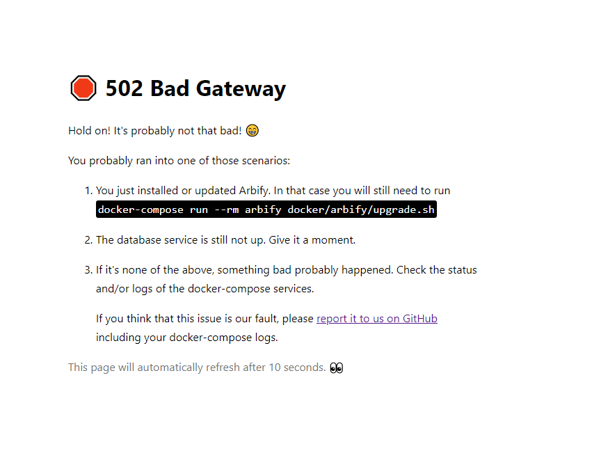
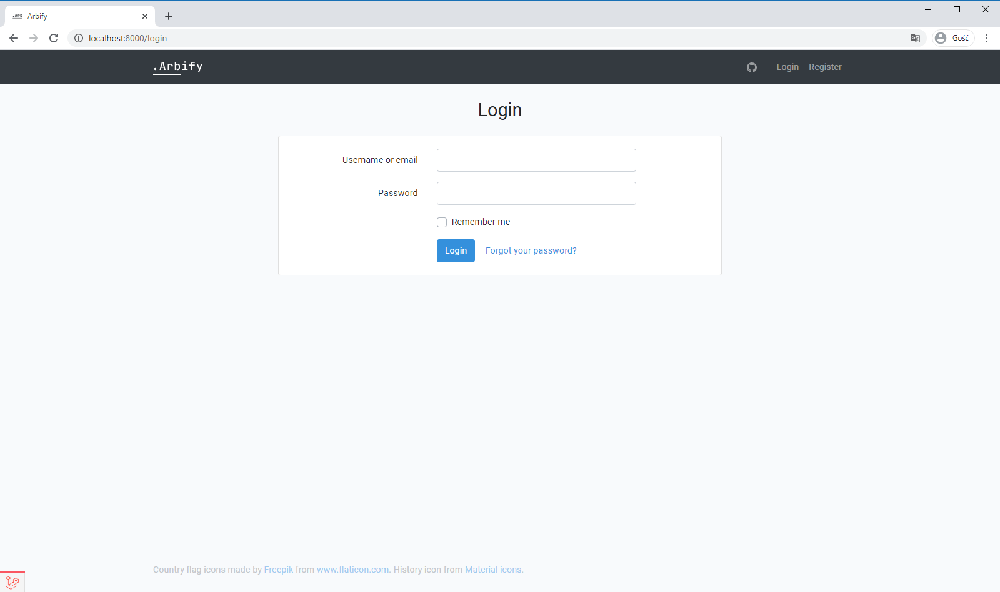
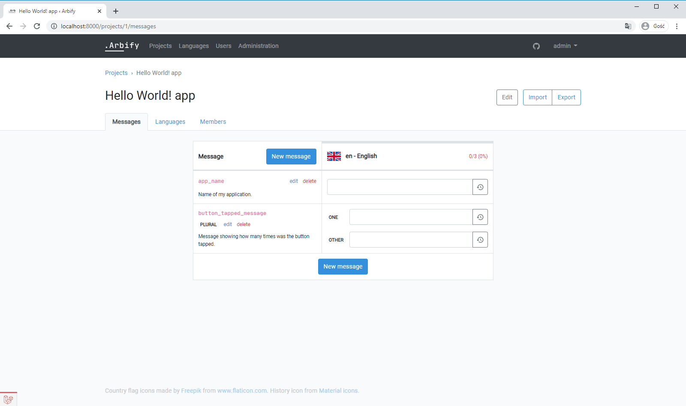
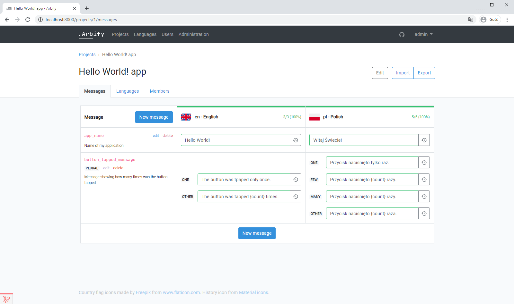
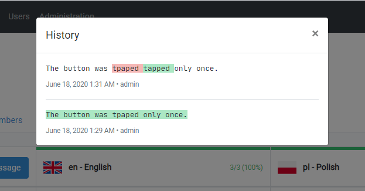
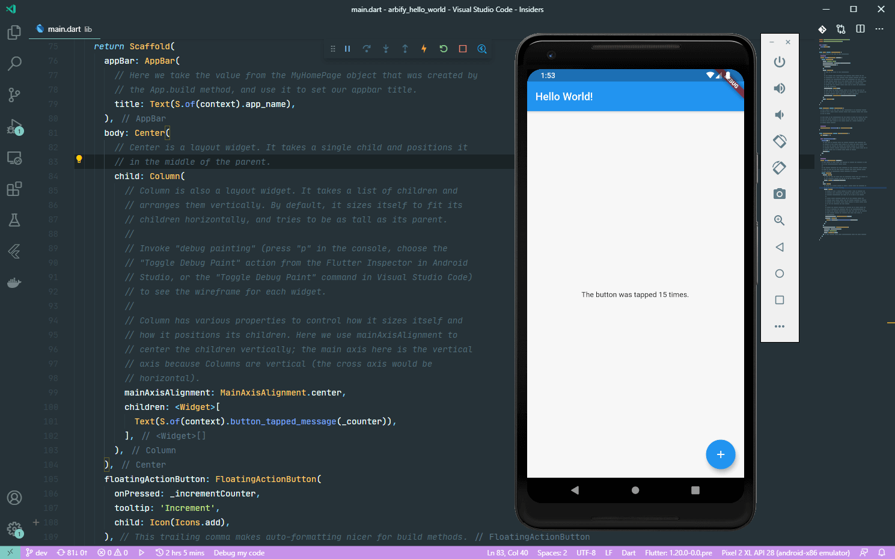

# Tutorial on deploying Arbify locally and using it in your Flutter app

In this article, I’ll walk you through deploying Arbify on your computer using Docker and we’ll build a Hello World! Flutter application utilizing internationalized messages created in Arbify.

## Table of contents

- [Deploying](#deploying)
- [Creating our first project](#creating-our-first-project)
- [Integrating Arbify into the Flutter app](#integrating-arbify-into-the-flutter-app)
- [End result files](#end-result-files)

## Deploying


Firstly, we have to clone the [GitHub repository](https://github.com/Arbify/Arbify):

```bash
git clone git@github.com:Arbify/Arbify.git
cd Arbify
```

The next thing we need to do is copy the `.env.example` file into our brand new `.env` configuration file.

```bash
cp .env.example .env
```

We don’t need to change anything fancy here. We’ll leave it on defaults.

> Defaults were meant for deploying your own Arbify using Docker without a hassle, to try it and play with it. If you want to use it on a server, you probably want to enable production mode and set up a proper SMTP server.

Now it’s time for building the Dockerfile:

```bash
docker-compose build arbify
```

As you can see we use `docker-compose` here. Arbify ships with a neat `docker-compose.yml` that handles a great portion of effort for you. Running this command may take a while depending on your network connection speed and computer power.

Once the `build` command succeeded, it’s time for a final deploy!

```bash
docker-compose up -d
```

You can now go to [http://localhost:8000](http://localhost:8000) in your web browser. You should see something like this:



Don’t worry, it’s all good! As you can see there, we need to run one last command to finish.

```bash
docker-compose run --rm arbify docker/arbify/upgrade.sh
```

This step can take a while too. It downloads all backend and frontend dependencies and compiles them. Once you do this for the first time though, the majority of your dependencies will be cached if you wanted to upgrade to a new version sometime in the future.

Your browser should refresh when the command from the previous step finished and you should see something like this:



Log in to the Arbify with a default super administrator account using a username `admin` and a super-secure password `password`.

The first thing we may want to do is change the admin’s password to something more personal and secure.

Click on the _Users_ link at the top navigation bar and then on _Edit_ next to the admin account. Set your new password and click _Update user_.

## Creating our first project

Let’s go to the _Projects_ page and let’s click _New project_. Write some nice name for our first project and click _Create project_. Once you created it, open it by clicking on the new item on the list.

Now it’s time for creating our messages! Click _New message_ and add one. Let’s call it `app_name`.

Since this project is for the default Flutter Hello world app, I’m gonna add one more message, `button_tapped_message`, but this time it will be a plural message.



What’s the internationalization software for if we only have English here? Go to the _Languages_ tab and add a language of your choice. I’m going with Polish as it’s my native language.

After you do that, go back to the _Messages_ tab.

Let’s fill the blanks for our messages in English and the language you just added. Just click on a blank input, type your desired message, and hit Enter or defocus the field. Once it turned green you can be sure it’s saved.



When you fill one field after another you can see how the blue progress bar above the language name grows and eventually turns green. It means that you translated all the messages. Good job!

Oh shoot, I made a typo. I typed ‘tpaped’ instead of ‘tapped’ in the 2nd field for English. Let me just quickly fix it!

Are you wondering what are those weird buttons next to all fields?

That’s a message value history. We can see how I fixed my typo by clicking on this button:



Once all of your messages turned green, it’s time for integrating them in our Flutter app!

## Integrating Arbify into the Flutter app

Let’s begin with creating a new Flutter project.

```bash
flutter create arbify_hello_world
```

Add two dependencies to your `pubspec.yaml` file:

- [arbify](https://pub.dev/packages/arbify) and
- [intl](https://pub.dev/packages/intl).

After running `flutter pub get` (which has probably already run thanks to your code editor/IDE) it’s time to run the most important command for your integration with Arbify. You’ll most surely receive an error:

```
$ flutter pub run arbify:download

You don't have all the required configuration options. You can  
copy the template below and place it at the end of your pubspec.

arbify:
  url: https://arb.example.org
  project_id: 12
  output_dir: lib/l10n # This is the default value.
```

Do what it says. Make sure that the indentation is correct, i.e. `arbify:` isn’t prefixed with any spaces. Update URL with your Arbify URL, in case of this tutorial that’s `localhost:8000`. Update `project_id` too. If you’re wondering what’s the identifier of your project: open it in your browser and look at the URL. The number after `/projects/` is your project’s id. You can omit the `output_dir`, we’ll stick to the default. In our case that’s `1`.

Let’s run the command again. We should see a new prompt:

```
$ flutter pub run arbify:download

We couldn't find an Arbify secret. Please create a secret using
the URL below, paste it here and press Enter.

http://localhost:8000/account/secrets/create

Secret: _
```

Navigate to the given link and create a new secret. Use the name of your choice.

You should get a secret. Copy it and paste it to the command-line and press Enter.


After entering the secret, you should get an output showing the progress of downloading the messages.

```
Output directory doesn't exist. Creating... done.
pl                  Downloading... done.
en                  Downloading... done.
Generating l10n.dart file... done 
Generating messages dart files... done
```

You also have a new file in your project directory: `.secret.arbify`. It’s been added to your `.gitignore` too.

You can find a newly generated `lib/l10n/l10n.dart` file. We’ll use it now.

In your `MaterialApp`, add `supportedLocales` and `delegates` as follows:

```dart
    return MaterialApp(
      title: 'Flutter Demo',
      supportedLocales: S.delegate.supportedLocales,
      localizationsDelegates: [
        S.delegate,
      ],
      // (...)
```

And we’re done! All we have to do is use our brand new messages generated straight from Arbify!

```dart
      // Change AppBar title to app_name message:
      title: Text(S.of(context).app_name),

      // Change Scaffold > Center body to button_tapped_message:
      Text(S.of(context).button_tapped_message(_counter))
```

And voilà!



## End result files

Here are both `pubspec.yaml` and `lib/main.dart` files:

#### `pubspec.yaml`

```yaml
name: arbify_hello_world
description: A new Flutter project.

publish_to: 'none'

version: 1.0.0+1

environment:
  sdk: ">=2.7.0 <3.0.0"

dependencies:
  flutter:
    sdk: flutter
  arbify: ^0.0.6
  intl: ^0.16.1

dev_dependencies:
  flutter_test:
    sdk: flutter

flutter:
  uses-material-design: true

arbify:
  url: http://localhost:8000
  project_id: 1
  output_dir: lib/l10n # This is the default value.
```

#### `lib/main.dart`

```dart

import 'package:arbify_hello_world/l10n/l10n.dart';
import 'package:flutter/material.dart';

void main() {
  runApp(
    MaterialApp(
      supportedLocales: S.delegate.supportedLocales,
      localizationsDelegates: [
        S.delegate,
      ],
      home: MyHomePage(),
      onGenerateTitle: (context) => S.of(context).app_name,
    ),
  );
}

class MyHomePage extends StatefulWidget {
  @override
  _MyHomePageState createState() => _MyHomePageState();
}

class _MyHomePageState extends State<MyHomePage> {
  int _counter = 0;

  @override
  Widget build(BuildContext context) {
    return Scaffold(
      appBar: AppBar(
        title: Text(S.of(context).app_name),
      ),
      body: Center(
        child: Text(S.of(context).button_tapped_message(_counter)),
      ),
      floatingActionButton: FloatingActionButton(
        onPressed: () => setState(() => _counter++),
        child: Icon(Icons.add),
      ),
    );
  }
}
```
